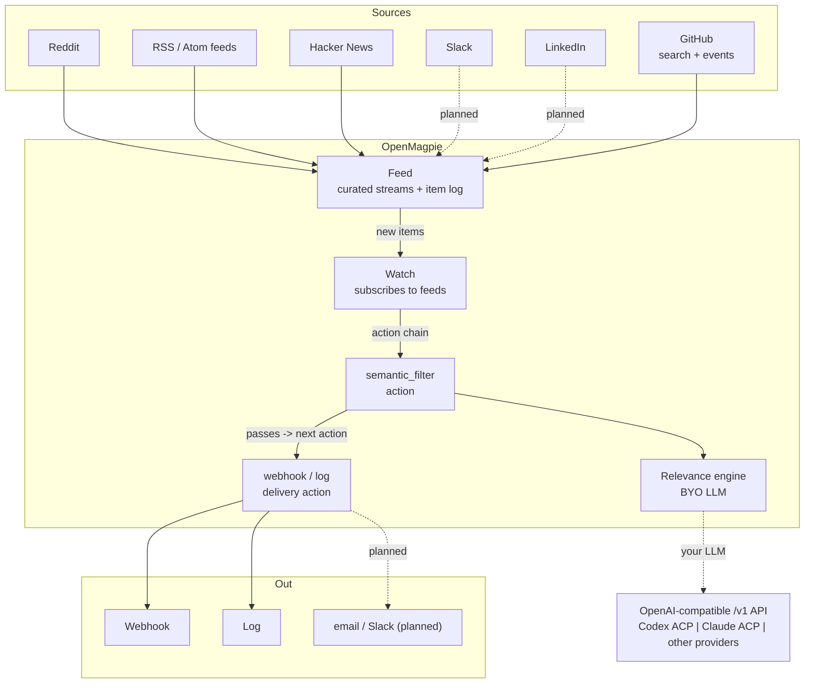

<p align="center">
  
</p>

<p align="center">
  Open-source social listening
</p>

<p align="center">
  <a href="LICENSE"></a>
</p>

<p align="center">
  <b><a href="https://www.openmagpie.ai/">openmagpie.ai</a></b> |
  <a href="#quickstart">Quickstart</a> |
  <a href="apps/cli/README.md">CLI reference</a> |
  <a href="CHANGELOG.md">Changelog</a>
</p>

---

<p align="center">
  
</p>

> [!TIP]
> **CLI not for you?** A UI / hosted version is on the way. Star the repo for updates, or join the waitlist at [openmagpie.ai](https://www.openmagpie.ai/).

## What it does

You scan Reddit, Hacker News, and a few RSS feeds looking for someone hitting a problem your product solves or asking a question you can answer well. Getting there while the conversation is happening is how you build a brand and a community around what you know. OpenMagpie watches the threads for you so you spend your time on engagement instead of searching.

You curate sources into a feed, write a natural-language description of what's relevant (for example, "someone frustrated with manual social monitoring and asking for alternatives"), and your configured relevance engine scores each new post against it. Matches go to a webhook or your logs (more integrations coming); everything else is dropped. You read the hits instead of the firehose.

## Where it listens

OpenMagpie listens wherever communities are having those conversations.

- **Public discussion (today):** Reddit, Hacker News, GitHub (repository search + new-repo events), and any RSS or Atom feed (news, blogs, Substack publications, and forums that publish feeds).
- **Communities you're in (roadmap):** Slack workspaces and LinkedIn you already belong to, so you catch relevant threads in the groups where you participate, no admin or app install required.

## Quickstart

Clone this checkout, configure the [Codex/Claude ACP bridge](integrations/acp-bridge/README.md), and run the local setup (Docker and uv required):

```bash
git clone https://github.com/matthewdonsemail-lab/listeningkit.git
cd listeningkit
./scripts/quickstart/run.sh
```

The setup creates a feed and watch, then runs one pipeline pass. For later one-time scans, run `make local-tick` and inspect the results with `magpie activity list --action <action-id>`. Use `SKIP_DATA_SEED=1 ./scripts/quickstart/run.sh` to bring up the stack without sample data. The feed and watch YAML are saved in `config/quickstart/` (see [config/README.md](config/README.md)).

### Prereq: an OpenAI-compatible LLM endpoint

OpenMagpie talks to an OpenAI-compatible `/v1` endpoint. This checkout uses the [host ACP bridge](integrations/acp-bridge/README.md) for Codex and Claude. The bridge uses your host agent sign-ins and sends source text to the selected provider. The quickstart validates the configured endpoint and lets you pick a model.

- **Codex or Claude on this Mac.** Start the ACP bridge and set `ENGINE_BASE_URL=http://host.docker.internal:3182/v1`, `ENGINE_MODEL=codex-acp` or `claude-acp`, and `ENGINE_API_KEY` to its local bridge token.
- **Other OpenAI-compatible endpoints.** Point `ENGINE_BASE_URL` at the endpoint's `/v1` URL and set its model ID and API key as required.

Set `ENGINE_MODEL` to the model you want to judge with. Agent response time and account usage vary by provider.

To change this checkout's live default between Codex and Claude, run the
[ACP provider selector](integrations/acp-bridge/README.md#choose-the-default-acp-agent).
It updates the core configuration and confirms the running model. Watch actions
that pin their own model keep that choice.

### Use it

The quickstart already built and seeded everything and put the `magpie` CLI on your `PATH`. Drive it from there:

```bash
magpie auth login                            # browser device flow
magpie feed create                           # opens $EDITOR on a feed template (sources + retention)
magpie watch create                          # opens $EDITOR on a watch template (feeds + action chain)
magpie activity summary --action <action_id> # per-state run breakdown for any action (filter, webhook, log)
```

On a headless box (a server you SSH into, no browser), skip the device flow and use a personal access token. Mint one on the server, then sign in with it on the box, the token is pasted (stdin or a hidden prompt, never the command line) and stored in `~/.magpie` at `0600`, persisting across sessions:

```bash
# on the server (the issue_cli_token management command, via the local stack):
make local-manage CMD="issue_cli_token --email you@example.com --name my-box"
# then, on the box:
magpie auth login --token   # paste the printed token at the prompt
```

For CI or an ephemeral box, set `MAGPIE_TOKEN=mgp_...` in the environment instead: it's
read on every request, takes precedence over a stored login, and is never persisted (the
`GH_TOKEN` pattern), so no login step. Manage tokens with `magpie auth token list` /
`create` / `revoke` (minting needs a browser login; a token can't mint another).

A watch's `actions:` chain typically starts with a `semantic_filter` (your natural-language criteria + threshold) followed by a `webhook` or `log` delivery. Pick a backfill window when you create the feed and the first `make local-tick` scores real posts against your criteria immediately, with no wait for the scheduler.

Full command list: the [magpie CLI reference](apps/cli/README.md). The dev loop runs through `make`: see [make/README.md](make/README.md) or `make help`.

### Running it continuously

`make local-tick` runs one pass by hand. For ongoing operation, start the background scheduler. The four pipeline stages each tick on their own cadence (poll feeds, trigger watches, drain runs, flush digests):

```bash
make up-jobs                  # start the tickers (a pid + log per stage under .jobs/)
tail -f .jobs/drain.log       # watch a stage
make down-jobs                # stop them
```

Each stage is single-flight: a pass that outruns its interval self-skips the next tick, so loops never stack. Production scheduling is then just a plain cron entry per command on the same cadences, with no flock or singleton infrastructure. Override any cadence inline, e.g. `make up-jobs DRAIN_INTERVAL=30`.

Run `make help` for the full target list (`make up` / `down`, `make logs`, `make local-test`, `make local-check`, and so on).

### Upgrading

The quickstart pins your checkout to the latest release. When a newer one ships, upgrade in place from your install directory:

```bash
make upgrade                  # or: ./scripts/upgrade.sh
```

It advances the checkout to the latest release tag, rebuilds the stack, applies migrations, and refreshes the `magpie` CLI. **Your data is preserved** (the database volume persists, migrations are additive, and it never re-seeds). For the bleeding edge instead of a release, `OPENMAGPIE_BRANCH=main make upgrade`.

## How it works

A `Feed` is a reusable, curated stream (a set of sources plus an item log). A `Watch` subscribes to one or more feeds and runs an ordered **action chain** over each new item: a `semantic_filter` gates the chain (a score below threshold stops it), and downstream `webhook` / `log` actions deliver what passes. One feed can back many watches, so you pay for source polling once.



Delivery is **instant** (per item) or **digest** (a window of items batched into one emission). A `webhook` action POSTs (or PUTs / PATCHes) one self-describing body; instant and digest use the same shape (instant is a one-item batch):

```json
{
  "watch": {"id": "01K...", "name": "ai-webhook"},
  "action_id": "01K...",
  "delivery": "digest",
  "window": {"since": "...", "until": "..."},
  "items": [
    {
      "key": "reddit_subreddit:abc123",
      "source": {"label": "r/ClaudeAI", "kind": "reddit_subreddit"},
      "item": {"title": "...", "url": "..."}
    }
  ]
}
```

`item` is the feed item narrowed to the action's `include_fields`. Each item's `key` is `source:external_id`; delivery is at-least-once, so receivers dedup on it. Every call is recorded as a `WatchActionDelivery` you can inspect:

```bash
make local-cli ARGS="delivery list --action <webhook_action_id>"    # the list: state / HTTP / host / items / attempt
make local-cli ARGS="delivery get <delivery_id>"                    # one call in full, incl. the exact body sent
```

See [AGENTS.md](AGENTS.md) for the design conventions (char pointers, typed-blob pattern, the trigger/drain/flush execution model).

### GitHub connectors

OpenMagpie ships two GitHub connectors that work together:

**`github_search`** — repository search via the public Search API (`GET /search/repositories`). You write a query with any GitHub qualifier (`language:typescript`, `topic:openai`, `stars:>100`) and the connector yields repos matching it, sorted by stars or last-updated. The LLM then scores each repo's description, language, topics, and README against your natural-language criteria. Best for ranking existing projects against your compatibility matrix.

**`github_events`** — new-repo radar via the public `/events` firehose. Polls the rolling ~30-event window, filters for `CreateEvent` + `ref_type: "repository"` (brand-new repos), enriches each with metadata and README, and yields the result. The watermark is `last_event_at` (no durable cursor, so events between polls that fall off the window are missed by design — same limitation as octoradar). Best for catching new projects the moment they're created.

Both connectors share the same error taxonomy, a common `GitHubClient`/`GitHubEventsClient` wrapper (httpx, optional `GITHUB_TOKEN` env var), and the same `NewRepoPayload`/`NewRepoEventPayload` shape. Payloads carry `full_name`, `stars`, `forks`, `language`, `topics`, `license`, `owner`, `description`, and README excerpt — everything the LLM needs to judge fit. A repo discovered first by radar, then later by search, collapses to one FeedItem (same `external_id` = `full_name`).

```json
{
  "kind": "github_search",
  "query": "tsoa OR hono OR qwik lang:typescript stars:>100",
  "sort": "stars",
  "min_stars": 100,
  "count": 20
}
```

```json
{
  "kind": "github_events",
  "event_types": ["create"],
  "include_pushes": false,
  "min_stars": 0
}
```

## Why self-host it

Social listening is a crowded market (Brand24, Mention, Octolens, Syften, and tools like OutX that pair monitoring with AI-drafted replies). They are all closed SaaS behind a paid plan, a trial, or a sales demo, and the few genuinely free options are basic mention notifiers, not full listening. OpenMagpie lets you run the listening stack on your own box and choose its relevance provider.

- **Open source.** Apache 2.0, the whole stack. Read it, fork it, and extend the connectors and engines yourself.
- **Choose your LLM.** Relevance can be judged through the Codex/Claude ACP bridge or another OpenAI-compatible endpoint. ACP sends source text to the selected provider.
- **Natural-language matching.** You describe what's relevant in natural language and the model scores each new post on meaning.
- **Auditable.** Every poll, judgement, and delivery is a row you can inspect (`magpie activity summary` / `delivery list`), as a table or `--jsonl` to pipe into `jq` / an LLM, or written to a file with `-o`.

## What's shipped today

| Layer | Shipped |
|---|---|
| Connectors | Reddit (`reddit_subreddit`), Hacker News (`hn_feed`, `hn_comment`), GitHub (`github_search`, `github_events`), RSS/Atom (`rss`) |
| Engines | Codex and Claude through the ACP bridge; other OpenAI-compatible `/v1` APIs |
| Action kinds | `semantic_filter` (LLM-judged), `webhook`, `log` |
| Delivery modes | instant, digest |
| Webhook methods | `POST`, `PUT`, `PATCH` |
| Delivery audit | per-attempt `WatchActionDelivery` |

## Roadmap

- **More connectors**: Slack, LinkedIn, Bluesky, Mastodon, and X.
- **More engines**: Anthropic, OpenAI, and a keyword engine behind the same `Engine` Protocol.
- **Learns from feedback**: thumbs up/down on past matches become few-shot examples for the next pass.
- **Run-history in the payload**: the upstream filter score and chain provenance as an opt-in webhook field.
- **Branching and parallel chains**: the data model already carries `WatchPath` and dense action ranks; multi-path and DAG branching are post-v1.
- **Retention**: pruning for `WatchActionRun` and `WatchActionDelivery` history.

## Hosted version

Self-hosting is free and stays free. A managed hosted version (no infrastructure to run) is in the works as the paid tier.

Join the waitlist at [openmagpie.ai](https://www.openmagpie.ai/).

## Project structure

uv workspace; one root `uv.lock` for everything Python.

```
apps/
  core/                       Django backend (deployable)
    common/                   BaseModel (ULID PK + timestamps), ULIDField, locks, db ceilings, /healthz
    accounts/                 User / Account / UserProfile + services + AccountScopedAPIView mixin
    auth_api/                 signup / login / logout / me + tokens/* + device-flow handshake (DRF)
    sources/                  Connectors (Reddit, Hacker News, GitHub, RSS/Atom) + SourcePayload classes + registry
    feeds/                    Feed + Source + FeedItem models + poll orchestrator + item log
    engine/                   Engine Protocol + OpenAICompatEngine + registry (+ probe)
    watches/                  Watch + WatchFeed + WatchPath + WatchAction + WatchActionRun + WatchActionDelivery
    conf/                     settings (base/local), urls, wsgi
  cli/                        magpie CLI (Typer + httpx + Pydantic); distributed as a standalone wheel
packages/
  openmagpie-schema/          Pure Pydantic models shared by core + cli (configs, wire types, feed shapes)
web/                          pnpm workspace: apps/{app,marketing,email-render} (Next.js) + packages/{ui,api-utils,auth,tailwind-config}
make/                         Per-concern Makefile targets
scripts/                      quickstart installer (quickstart/{bootstrap,preflight,run,seed,tick}.sh) + dev tooling (Docker preflight, git hooks, whitespace/branch/length checks, make-help)
```

## Documentation

- [CONTRIBUTING.md](CONTRIBUTING.md): contribution flow, branch naming, running the checks.
- [CHANGELOG.md](CHANGELOG.md): notable changes per release.
- [magpie CLI reference](apps/cli/README.md): install + the full command list.
- [make/README.md](make/README.md): the important dev `make` commands (`make help` for the full list).
- [AGENTS.md](AGENTS.md): cross-cutting design conventions, plus per-area notes: [apps/core](apps/core/AGENTS.md), [apps/cli](apps/cli/AGENTS.md), [web](web/AGENTS.md).

## Telemetry

OpenMagpie ships **anonymous, opt-in** usage telemetry, **off by default**. It helps prioritize what to build (a UI? which sources next? is setup too hard?) without ever sending your content. Enable it during `quickstart`, or with `make local-manage CMD="telemetry enable"`; turn it off any time with `make local-manage CMD="telemetry disable"` or `DO_NOT_TRACK=1`. Exactly what is and isn't collected: [apps/core/TELEMETRY.md](apps/core/TELEMETRY.md).

## License

OpenMagpie is open source under the [Apache License 2.0](LICENSE), with optional enterprise directories (`**/ee/`) reserved for future commercial features.
